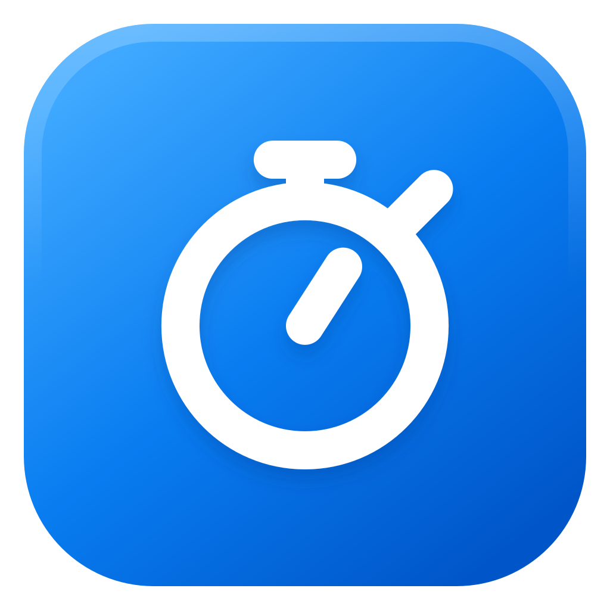

<p align="center">
  
</p>

# Web Time

A native macOS menu-bar app that gives distracting websites daily limits. Web Time tracks and blocks locally at the DNS and network level, so the same allowance applies across browsers and apps without an account or browser extension.

[Download the latest release](../../releases/latest/download/Web-Time.dmg)

## Features

- Separate daily limits for each website
- Works across browsers and native apps
- Menu-bar progress and Screen Time-style usage statistics
- Automatically blocks exhausted websites, with an unlocked 15-minute snooze
- Typing challenge protects settings and quitting from impulsive changes
- No account, analytics, telemetry, or cloud storage

## Install

Web Time requires macOS 13 or later.

1. Download and open `Web-Time.dmg`.
2. Open **Web Time Setup** and click **Install**.
3. Unlock the controls, add websites, and choose a daily limit for each one.

Installation requires an administrator password because Web Time runs a local DNS service. Web Time does not currently have an Apple Developer ID and is not notarized. If macOS blocks **Web Time Setup**, click **Done**, then open **System Settings → Privacy & Security**, scroll to **Security**, and click **Open Anyway**. Confirm **Open**, then run the setup again.

To remove Web Time and restore the previous DNS settings, open **Web Time Setup** and click **Uninstall**.

## Build from source

Install Xcode Command Line Tools, then run:

```bash
make test
make build
make install
```

To uninstall a source build:

```bash
make uninstall
```

## Data and privacy

Settings and usage history stay in:

```text
~/Library/Application Support/Web Time
```

Web Time does not collect browsing history or send usage data anywhere. See [PRIVACY.md](PRIVACY.md) for details.


## License

[MIT](LICENSE)
